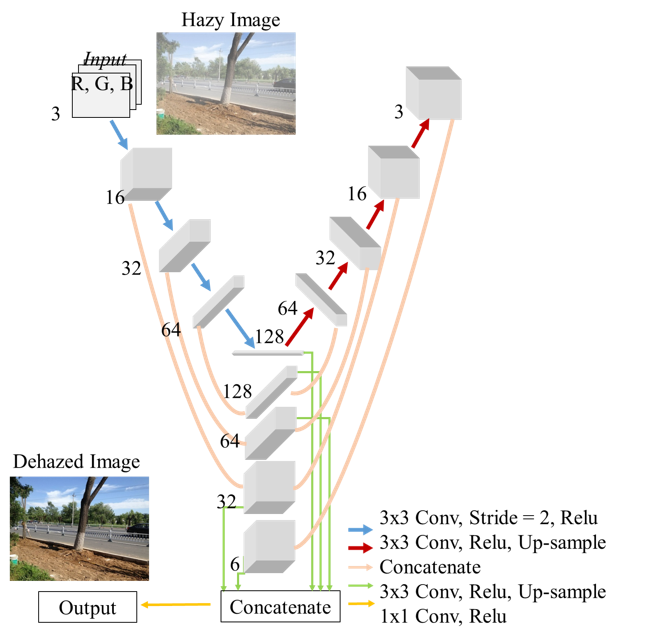

# Y-net
Y-NET: MULTI-SCALE FEATURE AGGREGATION NETWORK WITH WAVELET STRUCTURE SIMILARITY LOSS FUNCTION FOR SINGLE IMAGE DEHAZING - ICASSP 2020

This repository shows implementation of [Y-net and Wavelet Structure Simlarity Loss Function](https://ieeexplore.ieee.org/document/9053920). 

We provide the loss function and the network. Please refer our previous [repository](https://github.com/dectrfov/Wavelet-U-net-Dehazing) that contain wholes training codes.

<p align="center"></p>

## Dependencies
* [Python 3.6+](https://www.continuum.io/downloads)
* [PyTorch 1.1.0+](http://pytorch.org/)
* [PyWt](https://pypi.org/project/PyWt/)

## Usage
### 1. Cloning the repository
```bash
$ git clone https://github.com/dectrfov/Y-net.git
$ cd Y-net
```
### 2. Testing
```bash
$ python demo.py -d haze_img -m model/model_last.pkl
```
### 3. Use the Wavelet Structure Simlarity Loss Function
```bash
from wavelet_ssim_loss import WSloss
loss = WSloss()
```
<p align="center"></p>
